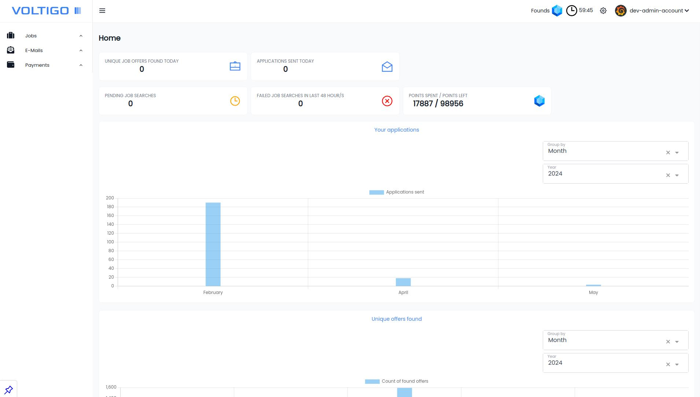

<i>
Aka bulk job offer search / bulk job applications mailer
</i>

<i>
Using any projects for personal gain is <b>STRICTLY FORBIDDEN</b>, You can however use it on Your own to make Your life easier.
</i>

<i>You can support this project here:</i> 

<i>You can also support the project if You decide to use <b><a href="https://get.brightdata.com/mwjfqnunf35j">BrightData proxy</a></b> for <b>ProxyProvider</b>:</i> 

<i>Project related contact here, and <b>only</b> here:</i> 

# Demo

- Url:
- Login: admin
- Password: admin
- Other:
  - MessageHub demo url:

# Underlying projects

These projects are needed to make everything work altogether:
- <b><a href="https://github.com/Volmarg/voltigo-backend">Voltigo-backend</a></b>
- <b><a href="https://github.com/Volmarg/message-hub">MessageHub</a></b>
- <b><a href="https://github.com/Volmarg/job-offers-handler">JobSearcher</a></b>
- <b><a href="https://github.com/Volmarg/email-builder">EmailBuilder</a></b>
- <b><a href="https://github.com/Volmarg/voltigo-rabbit-mq">RabbitMQ</a></b>

These projects are optional:
- <b><a href="https://github.com/Volmarg/proxy-provider">ProxyProvider</a></b>
- <b><a href="https://github.com/Volmarg/voltigo-mailpit">MailPit</a></b>

# Explanations first

This project was supposed to become <b>SAAS</b>, and generate some income, but it stumbled upon tones of <b>law issues</b>,
so in the end launching it was not possible. Here I decided to share the project as an **open-source**.

There is no documentation provided, barely any job-boards/job-services configuration included (while I have easily 30+ boards configured), some dirty patched code,
to make things work for **open-source** (it was never planned to go public).

I will most likely provide some tiny patches on the beginning, but afterward I can work on it further only if I can get some income.

This being said, if You'd like to see the project going further, or You'd like to drop a <b>thanks</b>, then You can support me under the links visible on top.

From this point onward I will simply see where this will go on, if it's still worth it for me to invest my time here, and will decide how to handle things further.

At this moment, I can't promise to answer to any issues, merge-requests etc.

<i>Personally it's not a time wasted, it's a knowledge gained and cool tool to move onward whenever I'd need to.</i>

# About

This project takes criteria necessary for finding job offers, dispatches the search task and notifies user about finished searching.
Once the search results are delivered user can go over the found job offers and apply them all at once by using earlier prepared email template.

Long story short, You can call this: **Job application spammer** if You like it this way.

## What brought the project to live

Short answer is:

<blockquote style="font-style: italic;border-color:rgb(59, 130, 246)">
“I was getting frustrated of how long it takes to find job offers, apply on them, build up CV, or email, and then for each offer change the content of email to make it match the applied position. It was pure waste of time. Hours & weeks getting wasted. You go over hundreds of job offers, just to find the very few ones that match. You finally send the emails, and then silence... for weeks, months - they barely reply at all.”
</blockquote>

## Goal

Reduce time spent on:
- searching for job offers,
- reading through job offers,
- clicking over recruitment forms,
- adjusting the emails,

Overall:
- reduce stress and save time,
- change the approach to recruitment process,

## Recruitment approach / The 'Why'

<blockquote style="font-style: italic;border-color:rgb(59, 130, 246)">
“Companies barely reply on job applications, recruiters barely come back with feedback at all. Even if You do get a response, how many of these are 'no thanks'. This brought me to simple conclusion over the years: 'If they play this way then lets play their game, no more wasting time, i will spam them all and i just won't care'”.
</blockquote>

Well did this approach worked at all? It did! I'm still in the same job which I found with the old version of the project. I literally spammed companies and in the end, had a call, i got an invitation and it worked out, and oh boy much time I've saved back then, each day sending easily 50-100 applications.

## Preview

### GUI

### Workflow

 

 

<h3 style="display: inline; cursor: pointer;">Self-hosting / running the project</h3>
 

- You will need to set up the projects mentioned on top
  - You can skip the <b>ProxyProvider</b> if You don't plan to use any proxy at all, however if You plan to do searching more
    often then it's recommended to use proxy services,
    - I can recommend the <b><a href="https://get.brightdata.com/mwjfqnunf35j">BrightData</a></b> services, these You can find <b><a href="https://get.brightdata.com/mwjfqnunf35j">here</a></b>
  - **MailPit** can be skipped too if own mailer will be configured instead,
- All the mentioned projects are fully dockerized,
- For <b>this</b> project You need to:
  - go inside the `docker/prod` directory,
  - call `docker-compose -f docker-compose.yaml up -d`
  - the project is now reachable under : `10.9.0.6` (paste that in Your browser)

<h3 style="display: inline; cursor: pointer;">Creating account</h3>
 

*Assuming here that all necessary projects are running and are by now properly installed/configured* 

- go to start page (`/`),
- click `register`,
- fill the form and submit,
- now You need activation email which will be sent to the <a href="https://github.com/Volmarg/message-hub">MessageHub</a>,
- go to `cli` and call `docker exec -t voltigo-back-prod php bin/console voltigo:email:send-emails`
- go to <a href="https://github.com/Volmarg/message-hub">MessageHub</a> login panel, 
  - login, find Your email on list and click preview (eye icon), here You can click or copy the activation link, 
- now You can use **Voltigo**,

<h3 style="display: inline; cursor: pointer;">The target audience</h3>
 

- any kind of people (at least the ones who can use pc or phone), but mostly the ones who are lazy and annoyed with recruitment process, or just want to save time,

<h3 style="display: inline; cursor: pointer;">What about the Linkedin, job boards etc.</h3>
 

They exist, and I'm fully aware of that, none of these solve the problem, because all of them are, how should I write *"trying to go the standard way, little hello, email, some talking, some form etc."*.

While I just want to sent out emails and be done. The job boards are actually the source of the offers.

Solutions such as mine are there, but these work differently, those are for example bots that login to Linkedin on Your behalf. Click over each "apply button", or do pre configured campaign, where You don't see the offers.

You just configure the bot and it goes in cycle over and over again (most likely clicking on apply buttons in background as well).

<h3 style="display: inline; cursor: pointer;">Email sources</h3>
 

The emails used for job applications come from 2 main sources:
- job offers itself:
  - email gets extracted from the description (decoded if needed etc.),
- company website (which is searched for company name related to job offer)
  - same extraction logic as for job offer,

*This splits emails into 2 categories: "certain" (the one that comes from job offer), "uncertain" (comes from company website, it's never known if that's the E-mail address that should be used for job applications).*

*Extracted E-mail addresses are validated (is domain reachable, syntax etc.).*

*In the end around 60-80% of job offers have E-mail address attached to it.*

<h3 style="display: inline; cursor: pointer;">Company data sources</h3>
 

The extra data for job offer comes from:
- company website itself,
- 3rd party websites that have companies data,

